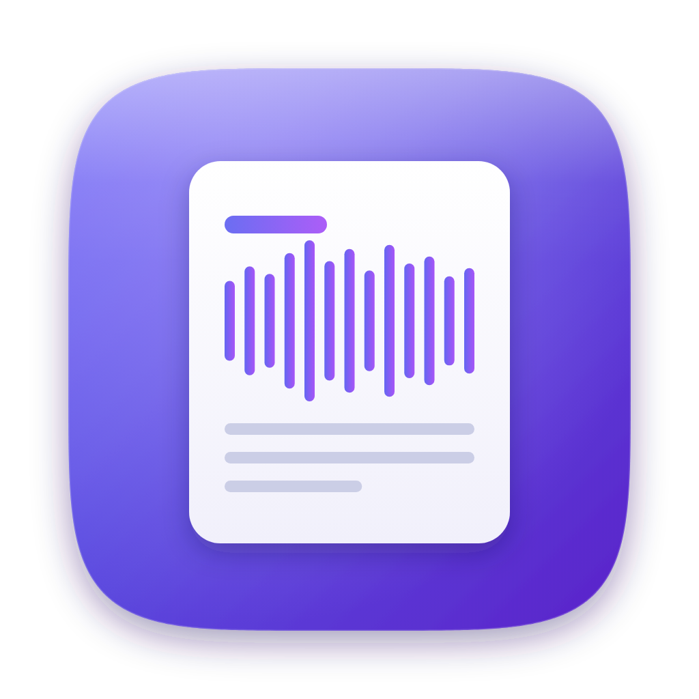

<p align="center">
  
</p>

<h1 align="center">Protokoll</h1>

<p align="center">
  <a href="https://github.com/Mtze/Protokoll/actions/workflows/ci.yml"></a>
</p>

<p align="center">
  <a href="https://mtze.github.io/Protokoll/"><strong>Documentation &amp; install guide &rarr;</strong></a>
</p>

**Protokoll turns your meetings into clear, decision-focused minutes - without your
audio ever leaving your Mac.** Hit record (your microphone and the call audio
together), and Protokoll transcribes locally with Whisper and drafts a structured
protocol - the decisions made, the action items with owners, and the open
questions to follow up on - using your existing Claude login. No API keys, no
subscriptions, no uploads: it's fast, free, and private by design, with native
apps for Mac, iPhone, and Apple Watch.

A local, free, privacy-preserving meeting recorder and protocol pipeline for
**macOS, iOS, and watchOS**. Record audio into a container of open files; a
Mac-side pipeline turns audio into a timestamped transcript and a
decisions-focused protocol. Everything runs on your own machines - transcription
is local (Whisper) and summarization uses your existing `claude` login, no API
key (N1). Nothing is uploaded to third parties (N2).

See [`ARCHITECTURE.md`](ARCHITECTURE.md) for the authoritative spec and ADRs, and
[`docs/IMPLEMENTATION_PLAN.md`](docs/IMPLEMENTATION_PLAN.md) for the milestone plan.

## Install via Homebrew

The easiest way to get the Mac app onto any Mac:

```bash
brew tap mtze/protokoll https://github.com/Mtze/Protokoll
brew install --cask protokoll
```

The tap URL is required because the cask lives in this app repo rather than a
`homebrew-protokoll` repo, so the one-argument `brew tap mtze/protokoll` form
won't resolve. Each tagged release (`v*`) publishes a zipped app to GitHub
Releases and auto-bumps [`Casks/protokoll.rb`](Casks/protokoll.rb).

Until the release is Developer ID-signed and notarized (see below), the app is
unsigned and macOS Gatekeeper blocks the first launch. Either approve it under
**System Settings > Privacy & Security** ("Open Anyway"), or install with
quarantine skipped:

```bash
brew install --cask --no-quarantine protokoll
```

## Features

**Apps**
- **macOS** - a full app (Dock icon + Library window) with a `MenuBarExtra` for
  quick recording, first-launch onboarding, diagnostics, and a tabbed Settings
  window.
- **iOS** - a lean recorder (optional title + geotag) plus a viewer and search.
- **watchOS** - a native recorder that hands recordings to the iPhone (ADR-6).

**Recording**
- Microphone capture with a **live waveform** that reacts to input (mic *and*
  system audio), and crash-safe incremental capture (CAF → `mic.m4a`, ADR-3).
- Optional **system-audio capture** (ScreenCaptureKit) for calls; mic + system
  are **mixed into one track** so the whole conversation is transcribed (ADR-7).

**Pipeline** (`process-session`)
- **Transcribe** locally via the vendored `transcribe.sh` (mlx-whisper /
  whisper.cpp), producing a timestamped `transcript.md`.
- **Summarize** via `claude -p` into a protocol: decisions, action items with
  owners, topics, and discussed-but-not-decided open points (F4). The app owns
  all file writes; protocols are versioned, never overwritten (N10).
- Resource-aware scheduler with per-step status, claim/lease for multi-machine
  safety, and re-runnable steps (ADR-4).

**Library**
- Sessions list with **full-text search** over transcript + protocol (FTS5).
- Native **playback**: scrubber, play/pause, and speed; the **transcript is
  tap-to-seek** (click a line to jump the audio there). Rendered Markdown
  summary with **Copy** and **Export**.
- **Session actions** on macOS live in the sidebar row's right-click menu (and
  the "Session" system menu): Process / Retry / Regenerate, **Rename**, Reveal in
  Finder, Assign to Project, and **Delete** (moved to the Trash).

**Keyboard control** (macOS): the app is fully operable from the keyboard via a
"Session" menu and the standard Window menu. Shortcuts:

| Shortcut | Action |
|---|---|
| `⌘N` | Start / stop recording |
| `⌘0` / `⇧⌘D` | Open Library / Diagnostics window |
| `⌘F` | Search the library |
| `⌘↩` | Primary action for the selected session (Process / Retry / Regenerate) |
| `⌘1` / `⌘2` | Show Protocol / Transcript |
| `⇧⌘C` | Copy the shown document |
| `⇧⌘R` | Reveal the session in Finder |
| `⌘⌫` | Delete the selected session |
| `Space` | Play / pause (while a session with audio is selected) |
| `←` / `→` | Seek ∓10s (while the audio player is focused) |

Menu items disable when nothing is selected; all labels are localized.

**Settings** (tabbed): General (consent reminder, system audio, playback speed),
Transcription (language, domain vocabulary, model), Summary (language, model,
custom instructions), Processing (auto-process, notifications), Advanced
(container path, tool overrides). Pipeline settings persist to the container so
`process-session` reads them too.

Localized **English + German** throughout.

## Prerequisites

- macOS 14+ on Apple Silicon, Xcode 26+, Swift 6.2. (iOS 17+, watchOS 10+.)
- [`xcodegen`](https://github.com/yonaskolb/XcodeGen) (`brew install xcodegen`).
- The app's **Diagnostics** panel installs the rest for you (`ffmpeg`, a Whisper
  engine, the model) with one-click Fix buttons. Manual fallback:
  ```bash
  brew install ffmpeg
  uv tool install mlx-whisper      # Apple Silicon, primary engine
  # or: brew install whisper-cpp && scripts/setup.sh --model large-v3
  ```
  **Install mlx-whisper, and use `uv` rather than `pip`.** Without a GPU engine
  the script falls back to `openai-whisper`, which runs on the CPU only: a
  52-minute meeting took 2 h 51 m that way versus 6 m 38 s with mlx-whisper.
  `pip install` fails on Homebrew Python with `externally-managed-environment`
  (PEP 668). Settings > Diagnostics warns when the slow fallback is in use.
- `claude` CLI installed and logged in (`claude login`) - no API key (N1).

## Build & run

```bash
# 1. Build + test the Swift package (SharedKit, pipeline, diagnostics, search, media)
swift build
swift test

# 2. Generate the Xcode project (the .xcodeproj is gitignored / regenerated)
xcodegen generate

# 3. Build an app (unsigned dev build); scheme: Protokoll-Mac | Protokoll-iOS | Protokoll-Watch
xcodebuild -project Protokoll.xcodeproj -scheme Protokoll-Mac \
  -destination 'platform=macOS' build CODE_SIGNING_ALLOWED=NO

# 4. Run the pipeline by hand on a session folder
.build/debug/process-session <session-folder> --step all   # or --step transcribe|summarize [--force]
```

The Mac target's build phase compiles `process-session` and bundles it (plus
`transcribe.sh`) into the app, so the running app can drive the pipeline itself.

### Install the Mac app locally (for real-world testing)

A locally-built app is **not** Gatekeeper-quarantined, so there's no
"unidentified developer" block. Build a Release app, ad-hoc sign it (so it
launches cleanly and macOS remembers its permissions), and drop it in
`/Applications`:

```bash
xcodegen generate
xcodebuild -project Protokoll.xcodeproj -scheme Protokoll-Mac \
  -configuration Release -destination 'platform=macOS' CODE_SIGNING_ALLOWED=NO build

APP=$(find ~/Library/Developer/Xcode/DerivedData/Protokoll-*/Build/Products/Release \
  -maxdepth 1 -name Protokoll.app | head -1)
codesign --force --deep --sign - "$APP"          # ad-hoc sign (incl. the bundled helper)
osascript -e 'quit app "Protokoll"' 2>/dev/null   # close a previous copy
rm -rf /Applications/Protokoll.app
ditto "$APP" /Applications/Protokoll.app
open /Applications/Protokoll.app
```

Re-run this after code changes to reinstall. First launch: onboarding requests
the microphone (Screen Recording and Notifications are optional); then open
**Settings → Diagnostics** and use the Fix buttons to install `ffmpeg` / a
Whisper engine / the model, confirm `claude` is logged in, and run the
System-Test. Recordings live under
`~/Library/Application Support/Protokoll/Container`.

Notes:
- **Menu-bar app:** prefer this install over "Run" in Xcode (which kills the app
  when you stop the run).
- **Icon not updating?** macOS caches app icons; re-register with
  `lsregister -f /Applications/Protokoll.app` (under
  `…/CoreServices/…/LaunchServices.framework/…/Support/`) and `killall Dock`.
- **Permissions reset after reinstall?** Ad-hoc signatures can change between
  builds, which resets TCC grants - re-grant from Settings → Diagnostics.
- For a signed, one-command install on any Mac, see *Releases* below /
  *Install via Homebrew* above.

### Configuration

Transcription and summary tuning (language, vocabulary, models, audio
preparation, custom instructions) is edited in the app's **Settings** and stored in
`<container>/config/pipeline.json`, which `process-session` also reads - so
standalone runs honor the same settings.

The **structure of the summary** is a separate, editable file:
`<container>/config/summary-prompt.md`. When it is absent you get the built-in
default, a chronological account of the meeting. Settings > Summary edits it, and
"Reset to default" deletes it. The meeting title and language are always extracted
regardless of what the file says (ADR-9), and previous protocols are kept as
`protocol.vN.md`, so an edit that turns out badly is always recoverable.

Environment overrides for dev / standalone runs:

| Variable | Purpose |
|----------|---------|
| `PROCESS_SESSION_BIN` | Path to the `process-session` binary the app runs. |
| `TRANSCRIBE_SH` | Path to the vendored `scripts/transcribe.sh`. |
| `CLAUDE_BIN` | Path to the `claude` CLI. |
| `MN_CONTAINER_ROOT` | Override the container folder (dev/tests). |
| `MN_REPO_ROOT` | Repo root for the app's dev helper/asset fallbacks. |

In dev the app stores sessions under
`~/Library/Application Support/Protokoll/Container`. The real iCloud container is
wired in M3.

## Layout

```
Sources/SharedKit/      Foundation-only model, container, PipelineConfig, PipelineRunner (ADR-2)
Sources/ProcessSession/ the process-session pipeline CLI (ADR-1)
Sources/Diagnostics/    preflight checks, remediation, System-Test
Sources/SearchIndex/    local FTS5 search index (ADR-2)
Sources/MediaKit/       audio mixing: mic + system → one track (ADR-7)
Apps/Mac/               menubar + full window app, Recorder (ADR-3), onboarding, Settings
Apps/iOS/               iOS recorder + viewer + search
Apps/Watch/             watchOS recorder (ADR-6)
Apps/Shared/            shared SwiftUI views, scheduler (ADR-4), AppModel, String Catalog,
                        Resources/Assets.xcassets (shared AppIcon)
Apps/Common/            cross-platform audio player, waveform, document views
scripts/                vendored transcribe.sh (+ setup.sh)
docs/branding/          app icon source art (SVG, icns, 1024 master)
fastlane/               build/test lanes
Casks/                  Homebrew cask (protokoll.rb) for `brew install --cask` (ADR-8)
.github/workflows/      root ci.yml orchestrates reusable test/build/release workflows (ADR-8)
site/                   static GitHub Pages user-docs one-pager (deployed by pages.yml)
```

The app icon is one shared `AppIcon` set in
`Apps/Shared/Resources/Assets.xcassets`, wired into the Mac, iOS, and watchOS
targets via `ASSETCATALOG_COMPILER_APPICON_NAME` in `project.yml`. Edit the
source art under `docs/branding/`, not the catalog PNGs.

## Testing & CI

`swift test` runs the Swift Testing suites for SharedKit, the pipeline,
Diagnostics, SearchIndex, and MediaKit. The subprocess boundary
(`CommandRunning`) is faked so tests never shell out to Whisper or `claude`.
A single root workflow ([`.github/workflows/ci.yml`](.github/workflows/ci.yml))
owns all triggers and concurrency and calls reusable workflows: it runs the test
suite plus unsigned Mac/iOS/watchOS builds on pull requests and pushes to `main`
(so each commit gets exactly one run, never a duplicate from the push *and* PR
events). `fastlane test` wraps the tests locally.

## Releases, signing & notarization

Distribution runs through the reusable
[`.github/workflows/release.yml`](.github/workflows/release.yml), invoked by the
root `ci.yml` on a `v*` tag once test + build pass. Pushing a version tag builds
the Mac app, zips it, publishes a GitHub Release, and bumps the Homebrew cask:

```bash
git tag v0.1.0 && git push origin v0.1.0
```

Dev and default release builds are **unsigned** (`CODE_SIGNING_ALLOWED=NO`). For
a clean first launch the Mac app should be **non-sandboxed, Developer ID-signed,
notarized** (it execs user-installed CLIs which the App Sandbox forbids -
decision #3, ADR-8). The release workflow's sign + notarize step is wired but
stays off until these repo secrets exist; add them to flip it on with no code
change:

| Secret | Purpose |
|--------|---------|
| `MACOS_CERTIFICATE` | base64 of the Developer ID Application `.p12` |
| `MACOS_CERTIFICATE_PWD` | password for that `.p12` |
| `MACOS_SIGN_IDENTITY` | e.g. `Developer ID Application: Name (TEAMID)` |
| `KEYCHAIN_PASSWORD` | throwaway password for the CI keychain |
| `NOTARY_APPLE_ID` | Apple ID email for `notarytool` |
| `NOTARY_PASSWORD` | app-specific password for that Apple ID |
| `NOTARY_TEAM_ID` | Developer Team ID |

The cask-bump step pushes to `main`; if `main` is branch-protected, bump
[`Casks/protokoll.rb`](Casks/protokoll.rb) via a PR instead.

## Logging & debugging

All apps and the `process-session` CLI log through one facility, `AppLog`
(`Sources/SharedKit/AppLog.swift`), built on Apple's unified logging
(`os.Logger`). Everything shares the subsystem `com.protokoll` with a category
per flow: `recording`, `systemaudio`, `pipeline`, `scheduler`, `diagnostics`,
`container`, `search`.

View logs live from the terminal or in Console.app:

```bash
# Everything from the app + pipeline
log stream --predicate 'subsystem == "com.protokoll"'

# Just one flow
log stream --predicate 'subsystem == "com.protokoll" && category == "pipeline"'

# Past hour, including debug/info
log show --last 1h --debug --info --predicate 'subsystem == "com.protokoll"'
```

Privacy: logs never contain transcript or audio content - only session IDs,
folder names, states, step names, durations, exit codes, and error messages.
